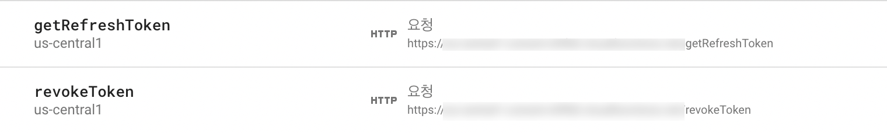

# apple-token-revoke-in-firebase

This document describes how to revoke the token of Sign in with Apple in the Firebase environment.<br>
In accordance with Apple's review guidelines, apps that do not take action by June 30, 2022 may be removed.<br>
A translator was used to write this document, so I apologize whenever you feel weird about these sentences and describes.<br>
**This document uses Firebase's Functions, and if Firebase provides related function in the future, I recommend using it.**

The whole process is as follows.
1. Get authorizationCode from App where user log in.
2. Get a refresh token with no expiry time using authorizationCode with expiry time.
3. After saving the refresh token, revoke it when the user leaves the service.

You can get a refresh token at https://appleid.apple.com/auth/token and revoke at https://appleid.apple.com/auth/revoke.

## Getting started

If you have implemented Apple Login using Firebase, you should have ASAuthorizationAppleIDCredential somewhere in your project.<br>
In my case, it is written in the form below.

```
  func authorizationController(controller: ASAuthorizationController, didCompleteWithAuthorization authorization: ASAuthorization) {
    if let appleIDCredential = authorization.credential as? ASAuthorizationAppleIDCredential {
      guard let nonce = currentNonce else {
        fatalError("Invalid state: A login callback was received, but no login request was sent.")
      }
      guard let appleIDToken = appleIDCredential.identityToken else {
        print("Unable to fetch identity token")
        return
      }
      guard let idTokenString = String(data: appleIDToken, encoding: .utf8) else {
        print("Unable to serialize token string from data: \(appleIDToken.debugDescription)")
        return
      }
      // Initialize a Firebase credential.
      let credential = OAuthProvider.credential(withProviderID: "apple.com",
                                                IDToken: idTokenString,
                                                rawNonce: nonce)
      // Sign in with Firebase.
      Auth.auth().signIn(with: credential) { (authResult, error) in
        if error {
          // Error. If error.code == .MissingOrInvalidNonce, make sure
          // you're sending the SHA256-hashed nonce as a hex string with
          // your request to Apple.
          print(error.localizedDescription)
          return
        }
        // User is signed in to Firebase with Apple.
        // ...
      }
    }
  }
  ```
What we need is the authorizationCode. Add the following code under guard where you get the idTokenString.

  ```
  ...
  
  guard let idTokenString = String(data: appleIDToken, encoding: .utf8) else {
    print("Unable to serialize token string from data: \(appleIDToken.debugDescription)")
    return
  }

  // Add new code below
  if let authorizationCode = appleIDCredential.authorizationCode,
     let codeString = String(data: authorizationCode, encoding: .utf8) {
      print(codeString)
  }
  
  ...
  
  ```
  
Once you get this far, you can get the authorizationCode when the user log in.<br>
However, we need to get a refresh token through authorizationCode, and this operation requires JWT, so let's do this with Firebase functions.
Turn off Xcode for a while and go to your code in Firebase functions.<br>
If you have never used functions, please refer to https://firebase.google.com/docs/functions.

In Firebase functions, you can use JavaScript or TypeScript, for me, I used JavaScript.

First, let's declare a function that creates a JWT globally. Install the required packages with npm install.<br>
There is a place to write route of your key file and ID(Team, Client, Key), so plz write your own information.<br>
If you do not know your ID information, please refer to the relevant issue. https://github.com/jooyoungho/apple-token-revoke-in-firebase/issues/1

  ```
  function makeJWT() {

    const jwt = require('jsonwebtoken')
    const fs = require('fs')

    // Path to download key file from developer.apple.com/account/resources/authkeys/list
    let privateKey = fs.readFileSync('AuthKey_XXXXXXXXXX.p8');

    //Sign with your team ID and key ID information.
    let token = jwt.sign({ 
    iss: 'YOUR TEAM ID',
    iat: Math.floor(Date.now() / 1000),
    exp: Math.floor(Date.now() / 1000) + 120,
    aud: 'https://appleid.apple.com',
    sub: 'YOUR CLIENT ID'
    
    }, privateKey, { 
    algorithm: 'ES256',
    header: {
    alg: 'ES256',
    kid: 'YOUR KEY ID',
    } });
    
    return token;
  }
  ```
  
The above function is returned by creating JWT based on your key information.<br>
Now, let's get the Refresh token with AuthorizationCode.<br>
We will add a function called getRefreshToken to functions.

  ```
  exports.getRefreshToken = functions.https.onRequest(async (request, response) => {

      //import the module to use
      const axios = require('axios');
      const qs = require('qs')

      const code = request.query.code;
      const client_secret = makeJWT();

      let data = {
          'code': code,
          'client_id': 'YOUR CLIENT ID',
          'client_secret': client_secret,
          'grant_type': 'authorization_code'
      }
      
      return axios.post(`https://appleid.apple.com/auth/token`, qs.stringify(data), {
      headers: {
          'Content-Type': 'application/x-www-form-urlencoded'
      },
      })
      .then(async res => {
          const refresh_token = res.data.refresh_token;
          response.send(refresh_token);
          
      });

  });
  ```

When you call the above function, you get the code from the query and get a refresh_token.
For code, this is the authorizationCode we got from the app in the first place.
Before connecting to the app, let's add a revoke function as well.


  ```

exports.revokeToken = functions.https.onRequest( async (request, response) => {

    //import the module to use
    const axios = require('axios');
    const qs = require('qs');

    const refresh_token = request.query.refresh_token;
    const client_secret = makeJWT();

    let data = {
        'token': refresh_token,
        'client_id': 'YOUR CLIENT ID',
        'client_secret': client_secret,
        'token_type_hint': 'refresh_token'
    };

    return axios.post(`https://appleid.apple.com/auth/revoke`, qs.stringify(data), {
        headers: {
            'Content-Type': 'application/x-www-form-urlencoded'
        },
    })
    .then(async res => {
        console.log(res.data);
    });
});

  ```

The above function revokes the login information based on the refresh_token we got.<br>
So far we have configured our functions, and when we do 'firebase deploy functions' we will have something we added to the Firebase functions console.



Now back to Xcode.<br>
Call the Functions address in the code you wrote earlier to save Refresh token.<br>
I saved it in UserDefaults, You can save it in the Firebase database.

  ```
  ...

  // Add new code below
  if let authorizationCode = appleIDCredential.authorizationCode, let codeString = String(data: authorizationCode, encoding: .utf8) {
                
        let url = URL(string: "https://YOUR-URL.cloudfunctions.net/getRefreshToken?code=\(codeString)".addingPercentEncoding(withAllowedCharacters: .urlQueryAllowed) ?? "https://apple.com")!
              
          let task = URLSession.shared.dataTask(with: url) {(data, response, error) in
              
              if let data = data {
                  let refreshToken = String(data: data, encoding: .utf8) ?? ""
                  print(refreshToken)
                  UserDefaults.standard.set(refreshToken, forKey: "refreshToken")
                  UserDefaults.standard.synchronize()
              }
          }
        task.resume()
        
    }
  
  ...
  
  ```


At this point, the user's device will save the refresh_token as UserDefaults when logging in.
Now all that's left is to revoke when the user leaves the service.


  ```
    func removeAccount() {
      let token = UserDefaults.standard.string(forKey: "refreshToken")

      if let token = token {
        
          let url = URL(string: "https://YOUR-URL.cloudfunctions.net/revokeToken?refresh_token=\(token)".addingPercentEncoding(withAllowedCharacters: .urlQueryAllowed) ?? "https://apple.com")!
                
          let task = URLSession.shared.dataTask(with: url) {(data, response, error) in
            guard data != nil else { return }
          }
                
          task.resume()
          
      }
      ...
      //Delete other information from the database...
      FirebaseAuthentication.shared.signOut()
    }
          
  ```

If we've followed everything up to this point, our app should have been removed from your Settings - Password & Security > Apps Using Apple ID.

Thank you.
